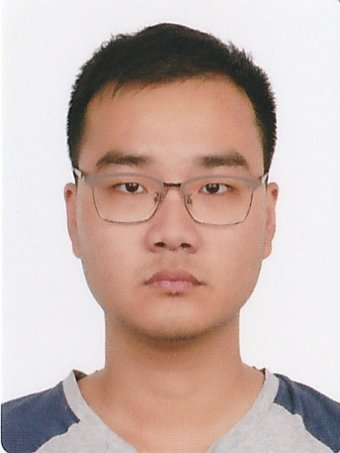
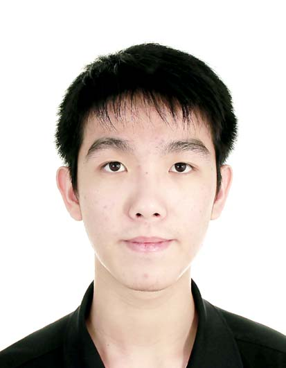

We are a team based in the [School of Computing, National University of Singapore](http://www.comp.nus.edu.sg).

## Project team

### Shulong

[[github](https://github.com/DreamerDragon)]
[[portfolio](team/dreamerdragon.md)]

* Role: Developer
* Responsibilities: Visit class

### Qirui

[[github](https://github.com/hhdqirui)]
[[portfolio](team/hhdqirui.md)]

* Role: Developer
* Responsibilities: Data

### Siang Ern

[[github](http://github.com/siangernlow)]
[[portfolio](team/siangernlow.md)]

* Role: Developer
* Responsibilities: Data

### Pin Xian

[[github](https://github.com/hopinxian)]
[[portfolio](team/hopinxian.md)]

* Role: Team Lead, Developer
* Responsibilities: Person, Location classes

### Han Ming

[[github](https://github.com/KohHanMing)]
[[portfolio](team/kohhanming.md)]

* Role: Developer
* Responsibilities: UI

