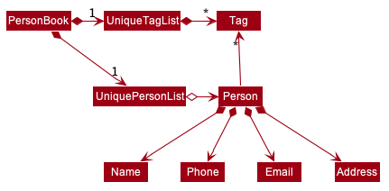

* Table of Contents
{:toc}

--------------------------------------------------------------------------------------------------------------------

## **Setting up, getting started**

Refer to the guide [_Setting up and getting started_](SettingUp.md).

--------------------------------------------------------------------------------------------------------------------

## **Design**

### Architecture

The ***Architecture Diagram*** given above explains the high-level design of the App. Given below is a quick overview of each component.

:bulb: **Tip:** The `.puml` files used to create diagrams in this document can be found in the [diagrams](https://github.com/se-edu/addressbook-level3/tree/master/docs/diagrams/) folder. Refer to the [_PlantUML Tutorial_ at se-edu/guides](https://se-education.org/guides/tutorials/plantUml.html) to learn how to create and edit diagrams.

**`Main`** has two classes called [`Main`](https://github.com/se-edu/addressbook-level3/tree/master/src/main/java/seedu/address/Main.java) and [`MainApp`](https://github.com/se-edu/addressbook-level3/tree/master/src/main/java/seedu/address/MainApp.java). It is responsible for,
* At app launch: Initializes the components in the correct sequence, and connects them up with each other.
* At shut down: Shuts down the components and invokes cleanup methods where necessary.

[**`Commons`**](#common-classes) represents a collection of classes used by multiple other components.

The rest of the App consists of four components.

* [**`UI`**](#ui-component): The UI of the App.
* [**`Logic`**](#logic-component): The command executor.
* [**`Model`**](#model-component): Holds the data of the App in memory.
* [**`Storage`**](#storage-component): Reads data from, and writes data to, the hard disk.

Each of the four components,

* defines its *API* in an `interface` with the same name as the Component.
* exposes its functionality using a concrete `{Component Name}Manager` class (which implements the corresponding API `interface` mentioned in the previous point.

For example, the `Logic` component (see the class diagram given below) defines its API in the `Logic.java` interface and exposes its functionality using the `LogicManager.java` class which implements the `Logic` interface.

**How the architecture components interact with each other**

The *Sequence Diagram* below shows how the components interact with each other for the scenario where the user issues the command `delete 1`.

The sections below give more details of each component.

### UI component

**API** :
[`Ui.java`](https://github.com/se-edu/addressbook-level3/tree/master/src/main/java/seedu/address/ui/Ui.java)

The UI consists of a `MainWindow` that is made up of parts e.g.`CommandBox`, `ResultDisplay`, `PersonListPanel`, `StatusBarFooter` etc. All these, including the `MainWindow`, inherit from the abstract `UiPart` class.

The `UI` component uses JavaFx UI framework. The layout of these UI parts are defined in matching `.fxml` files that are in the `src/main/resources/view` folder. For example, the layout of the [`MainWindow`](https://github.com/se-edu/addressbook-level3/tree/master/src/main/java/seedu/address/ui/MainWindow.java) is specified in [`MainWindow.fxml`](https://github.com/se-edu/addressbook-level3/tree/master/src/main/resources/view/MainWindow.fxml)

The `UI` component,

* Executes user commands using the `Logic` component.
* Listens for changes to `Model` data so that the UI can be updated with the modified data.

### Logic component

**API** :
[`Logic.java`](https://github.com/se-edu/addressbook-level3/tree/master/src/main/java/seedu/address/logic/Logic.java)

1. `Logic` uses the `AddressBookParser` class to parse the user command.
1. This results in a `Command` object which is executed by the `LogicManager`.
1. The command execution can affect the `Model` (e.g. adding a person).
1. The result of the command execution is encapsulated as a `CommandResult` object which is passed back to the `Ui`.
1. In addition, the `CommandResult` object can also instruct the `Ui` to perform certain actions, such as displaying help to the user.

Given below is the Sequence Diagram for interactions within the `Logic` component for the `execute("delete 1")` API call.

:information_source: **Note:** The lifeline for `DeleteCommandParser` should end at the destroy marker (X) but due to a limitation of PlantUML, the lifeline reaches the end of diagram.

### Model component

**API** : [`Model.java`](https://github.com/se-edu/addressbook-level3/tree/master/src/main/java/seedu/address/model/Model.java)

The `Model`,

* stores a `UserPref` object that represents the user’s preferences.
* stores the address book data.
* exposes an unmodifiable `ObservableList<Person>` that can be 'observed' e.g. the UI can be bound to this list so that the UI automatically updates when the data in the list change.
* does not depend on any of the other three components.

:information_source: **Note:** An alternative (arguably, a more OOP) model is given below. It has a `Tag` list in the `AddressBook`, which `Person` references. This allows `AddressBook` to only require one `Tag` object per unique `Tag`, instead of each `Person` needing their own `Tag` object. 

### Storage component

**API** : [`Storage.java`](https://github.com/se-edu/addressbook-level3/tree/master/src/main/java/seedu/address/storage/Storage.java)

The `Storage` component,
* can save `UserPref` objects in json format and read it back.
* can save the address book data in json format and read it back.

### Common classes

Classes used by multiple components are in the `seedu.addressbook.commons` package.

--------------------------------------------------------------------------------------------------------------------

## **Implementation**

This section describes some noteworthy details on how certain features are implemented.

### \[Proposed\] Undo/redo feature

#### Proposed Implementation

The proposed undo/redo mechanism is facilitated by `VersionedAddressBook`. It extends `AddressBook` with an undo/redo history, stored internally as an `addressBookStateList` and `currentStatePointer`. Additionally, it implements the following operations:

* `VersionedAddressBook#commit()` — Saves the current address book state in its history.
* `VersionedAddressBook#undo()` — Restores the previous address book state from its history.
* `VersionedAddressBook#redo()` — Restores a previously undone address book state from its history.

These operations are exposed in the `Model` interface as `Model#commitAddressBook()`, `Model#undoAddressBook()` and `Model#redoAddressBook()` respectively.

Given below is an example usage scenario and how the undo/redo mechanism behaves at each step.

Step 1. The user launches the application for the first time. The `VersionedAddressBook` will be initialized with the initial address book state, and the `currentStatePointer` pointing to that single address book state.

Step 2. The user executes `delete 5` command to delete the 5th person in the address book. The `delete` command calls `Model#commitAddressBook()`, causing the modified state of the address book after the `delete 5` command executes to be saved in the `addressBookStateList`, and the `currentStatePointer` is shifted to the newly inserted address book state.

Step 3. The user executes `add n/David …​` to add a new person. The `add` command also calls `Model#commitAddressBook()`, causing another modified address book state to be saved into the `addressBookStateList`.

:information_source: **Note:** If a command fails its execution, it will not call `Model#commitAddressBook()`, so the address book state will not be saved into the `addressBookStateList`.

Step 4. The user now decides that adding the person was a mistake, and decides to undo that action by executing the `undo` command. The `undo` command will call `Model#undoAddressBook()`, which will shift the `currentStatePointer` once to the left, pointing it to the previous address book state, and restores the address book to that state.

:information_source: **Note:** If the `currentStatePointer` is at index 0, pointing to the initial AddressBook state, then there are no previous AddressBook states to restore. The `undo` command uses `Model#canUndoAddressBook()` to check if this is the case. If so, it will return an error to the user rather
than attempting to perform the undo.

The following sequence diagram shows how the undo operation works:

:information_source: **Note:** The lifeline for `UndoCommand` should end at the destroy marker (X) but due to a limitation of PlantUML, the lifeline reaches the end of diagram.

The `redo` command does the opposite — it calls `Model#redoAddressBook()`, which shifts the `currentStatePointer` once to the right, pointing to the previously undone state, and restores the address book to that state.

:information_source: **Note:** If the `currentStatePointer` is at index `addressBookStateList.size() - 1`, pointing to the latest address book state, then there are no undone AddressBook states to restore. The `redo` command uses `Model#canRedoAddressBook()` to check if this is the case. If so, it will return an error to the user rather than attempting to perform the redo.

Step 5. The user then decides to execute the command `list`. Commands that do not modify the address book, such as `list`, will usually not call `Model#commitAddressBook()`, `Model#undoAddressBook()` or `Model#redoAddressBook()`. Thus, the `addressBookStateList` remains unchanged.

Step 6. The user executes `clear`, which calls `Model#commitAddressBook()`. Since the `currentStatePointer` is not pointing at the end of the `addressBookStateList`, all address book states after the `currentStatePointer` will be purged. Reason: It no longer makes sense to redo the `add n/David …​` command. This is the behavior that most modern desktop applications follow.

The following activity diagram summarizes what happens when a user executes a new command:

#### Design consideration:

##### Aspect: How undo & redo executes

* **Alternative 1 (current choice):** Saves the entire address book.
  * Pros: Easy to implement.
  * Cons: May have performance issues in terms of memory usage.

* **Alternative 2:** Individual command knows how to undo/redo by
  itself.
  * Pros: Will use less memory (e.g. for `delete`, just save the person being deleted).
  * Cons: We must ensure that the implementation of each individual command are correct.

_{more aspects and alternatives to be added}_

### \[Proposed\] Data archiving

_{Explain here how the data archiving feature will be implemented}_

--------------------------------------------------------------------------------------------------------------------

## **Documentation, logging, testing, configuration, dev-ops**

* [Documentation guide](Documentation.md)
* [Testing guide](Testing.md)
* [Logging guide](Logging.md)
* [Configuration guide](Configuration.md)
* [DevOps guide](DevOps.md)

--------------------------------------------------------------------------------------------------------------------

## **Appendix: Requirements**

### Product scope

**Target user profile**:

* is a healthcare official involved in the Covid-19 pandemic
* has a need to generate statistics based on input data of the pandemic
* prefer desktop apps over other types
* can type fast
* prefers typing to mouse interactions
* is reasonably comfortable using CLI apps

**Value proposition**: produce useful statistics quickly and efficiently

### User stories

(For all user stories below, the **user** is a healthcare official, unless stated otherwise)

Priorities: High (must have) - `* * *`, Medium (nice to have) - `* *`, Low (unlikely to have) - `*`

| Priority | As a …​                                    | I want to …​                     | So that I can…​                                                        |
| -------- | ------------------------------------------ | ------------------------------ | ---------------------------------------------------------------------- |
| `* * *`  | user | generate a list of people currently stored in VirusTracker|  
| `* * *`  | user | generate a list of locations currently stored in VirusTracker|    
| `* * *`  | user | generate a list of visits currently stored in VirusTracker|    
| `* * *`  | user with access to visits data from SafeEntry app   | add visit data to a list | generate desired lists and track contacts with the infected cases|
| `* * *`  | user with access to the visit list| delete all visits by date | remove all the outdated visits inside the list |
| `* * *`  | user setting up SafeEntry checkpoints | identify locations with high risk of infection | know which places need these checkpoints the most |
| `* * *`  | user publishing daily reports | generate daily statistics quickly and easily|                                                         |
| `* * *`  | user managing infected patient | update people's infection status | keep the current epidemic situation up to date |
| `* * *`  | user managing quarantined people | update people's quarantine status | be aware of a person's quarantine status |
| `* * *`  | user managing infected people | update people's infection status | be aware of a person's infection status |
| `* * *`  | user | add location data to a list | generate information about which location needs to be disinfected |
| `* * *`  | user worried about virus outbreaks | generate locations that infected people have been to | disinfect those locations |
| `* * *`  | user worried about virus outbreaks | generate people that have been in contact with infected people | quarantine them for safety measures |
 
*{More to be added}*

### Use cases

(For all use cases below, the **System** is the `VirusTracker` and the **Actor** is the `user`, unless specified otherwise)

**UC01 - Add a visit**

**MSS**

1.  User chooses to add a visit.
2.  System requests for details of the visit. 
3.  User enters the required details.
4.  System adds the new visit.
5. System displays the updated visits list.

    Use case ends.

**Extensions**
      
* 3a. System detects error in the entered data.
    * 3a1. System prompts user for correct data.
    * 3a2. User enters new data.  
    Steps 3a1-3a2 are repeated until the data entered are correct.  
    Use case resumes at step 4.

* *a. At any time, User wishes to cancel the command.
    * a1. System acknowledges and returns user to main page.
         
    Use case ends.

**UC02 - Delete visits**

**MSS**

1. User chooses to clear the visit history.
2. System requests for details.
3. User enters the required information.
4. System deletes the visits based on the information entered.
5. System displays the updated visits list.  
   
   Use case ends.
      
**Extensions**
       
* 3a. System detects error in the entered data.
    * 3a1. System prompts user for correct data.
    * 3a2. User enters new data.  
    Steps 3a1-3a2 are repeated until the data entered are correct.  
    Use case resumes at step 4.
       
* *a. At any time, User wishes to cancel the command.
    * a1. System acknowledges and returns user to main page.
         
    Use case ends.

**UC03 - Add a location**

**MSS**

1.  User adds a location.
2.  System adds the new location.
3.  System displays the updated locations list.

    Use case ends.

**Extensions**
      
* 2a. System detects error in the entered data.
    * 2a1. System prompts user for correct data.
    * 2a2. User enters new data.  
    Steps 2a1-2a2 are repeated until the data entered are correct.  
    Use case resumes at step 3.
    
    Use case ends.

**UC04 - View all people**

**MSS**

1. User requests to list all people.
2. System shows a list of all people.

    Use case ends.

**Extensions**

* 2a. The list is empty.
    * 2a1. System generates a sample list.
    * 2a2. System shows the sample list.
    
  Use case ends.
    
**UC05 - View all locations**

**MSS**

1. User requests to list all locations.
2. System shows a list of all locations.

    Use case ends.

**Extensions**

* 2a. The list is empty.
    * 2a1. System generates a sample list.
    * 2a2. System shows the sample list.
    
  Use case ends.
    
**UC06 - View all visits**

**MSS**

1. User requests to list all visits.
2. System shows a list of all visits.

    Use case ends.

**Extensions**

* 2a. The list is empty.
    * 2a1. System generates a sample list.
    * 2a2. System shows the sample list.
    
  Use case ends.
    
**UC07 - View all infected people**

**MSS**

1. User requests to list all infected people
2. System shows a list of all infected people.

    Use case ends.

**Extensions**

* 2a. The list is empty.

  Use case ends.

* 2b. There are no infected people.
    * 2b1. Go to 2a.
    
**UC08 - View all quarantined people**

**MSS**

1. User requests to list all quarantined people
2. System shows a list of all quarantined people.

    Use case ends.

**Extensions**

* 2a. The list is empty.

  Use case ends.

* 2b. There are no quarantined people.
    * 2b1. Go to 2a.
    
**UC09 - View locations that an infected person has been to**

**MSS**

1. User requests to list locations that an infected person has been to.
2. System shows a list of locations that the infected person has been to.  

  Use case ends.

**Extensions**

* 2a. The list is empty.

    Use case ends.
    
* 2b. The person is not infected.

    Use case ends. 
    
* 2c. The system detects invalid user input.
    * 2c1. The system prompts the user to enter valid input.
    * 2c2. User enters new input.
    Steps 2c1-2c2 are repeated until the input entered is correct.  
        Use case resumes at step 2.
        
        Use case ends.       
       
    
**UC10 - View people in contact with an infected person**

**MSS**

1. User requests to list people in contact with an infected person.
2. System shows a list of people in contact with an infected person.  

  Use case ends.

**Extensions**

* 2a. The list is empty.

    Use case ends.   
    
* 2b. The person is not infected.

    Use case ends. 
    
* 2c. The system detects invalid user input.
    * 2c1. The system prompts the user to enter valid input.
    * 2c2. User enters new input.
    Steps 2c1-2c2 are repeated until the input entered is correct.  
        Use case resumes at step 2.
        
        Use case ends.  
    
**UC11 - View high-risk locations**

**MSS**

1. User requests to list locations with high risk of infection.
2. System shows a list of locations with high risk.  

  Use case ends.

**Extensions**

* 2a. The list is empty.

    Use case ends.

**UC12 - View daily statistics**

**MSS**

1. User requests to view statistics for that day.
2. System shows the statistics for that day.

  Use case ends.

**Extensions**

* 2a. There is not enough information to produce statistics for that day.  

    Use case ends.

**UC13 - Update infection status**

**MSS**

1. User requests to update the infection status of a person.
2. System requests for details of the person to be updated.
3. User enters the person's details.
4. System toggles the person's infection status.  

Use case ends.

**Extension**

* 4a. System is unable to find the person specified by the user.     
    * 4a1. System requests for correct details of the person.
    * 4a2. User enters the new details.  
    
  Steps 4a1 - 4a2 are repeated until the person specified by the user exists.  
  
  Use case resumes from step 4.
  
* *a. At any time, user choose to cancel the update.  
    
    Use case ends.  
    
**UC14 - Update quarantine status**

**MSS**

1. User requests to update the quarantine status of a person.
2. System requests for details of the person to be updated.
3. User enters the person's details.
4. System toggles the person's quarantine status.

**Extension**

* 4a. System is unable to find the person specified by the user.     
    * 4a1. System requests for correct details of the person.
    * 4a2. User enters the new details.  
    
  Steps 4a1 - 4a2 are repeated until the person specified by the user exists.  
  Use case resumes from step 4.
  
* *a. At any time, user choose to cancel the update.    
    Use case ends.  

### Non-Functional Requirements

1.  Should work on any _mainstream OS_ as long as it has Java `11` or above installed.
2.  Should be able to hold up to 1000 items for each type of list without a noticeable sluggishness in performance for typical usage.
3.  Should be able to switch between different types of data and manipulate them efficiently and quickly.
4.  A user with above average typing speed for regular English text (i.e. not code, not system admin commands) should be able to accomplish most of the tasks faster using commands than using the mouse.

*{More to be added}*

### Glossary

* **Visits**: A visit event occurs whenever a `Person` enters a `Location`. The `Date` of this visit is also recorded.
* **Mainstream OS**: Windows, Linux, Unix, OS-X
* **Private contact detail**: A contact detail that is not meant to be shared with others

--------------------------------------------------------------------------------------------------------------------

## **Appendix: Instructions for manual testing**

Given below are instructions to test the app manually.

:information_source: **Note:** These instructions only provide a starting point for testers to work on;
testers are expected to do more *exploratory* testing.

### Launch and shutdown

1. Initial launch

   1. Download the jar file and copy into an empty folder

   1. Double-click the jar file Expected: Shows the GUI with a set of sample contacts. The window size may not be optimum.

1. Saving window preferences

   1. Resize the window to an optimum size. Move the window to a different location. Close the window.

   1. Re-launch the app by double-clicking the jar file. 
       Expected: The most recent window size and location is retained.

1. _{ more test cases …​ }_

### Deleting a person

1. Deleting a person while all persons are being shown

   1. Prerequisites: List all persons using the `list` command. Multiple persons in the list.

   1. Test case: `delete 1` 
      Expected: First contact is deleted from the list. Details of the deleted contact shown in the status message. Timestamp in the status bar is updated.

   1. Test case: `delete 0` 
      Expected: No person is deleted. Error details shown in the status message. Status bar remains the same.

   1. Other incorrect delete commands to try: `delete`, `delete x`, `...` (where x is larger than the list size) 
      Expected: Similar to previous.

1. _{ more test cases …​ }_

### Saving data

1. Dealing with missing/corrupted data files

   1. _{explain how to simulate a missing/corrupted file, and the expected behavior}_

1. _{ more test cases …​ }_
