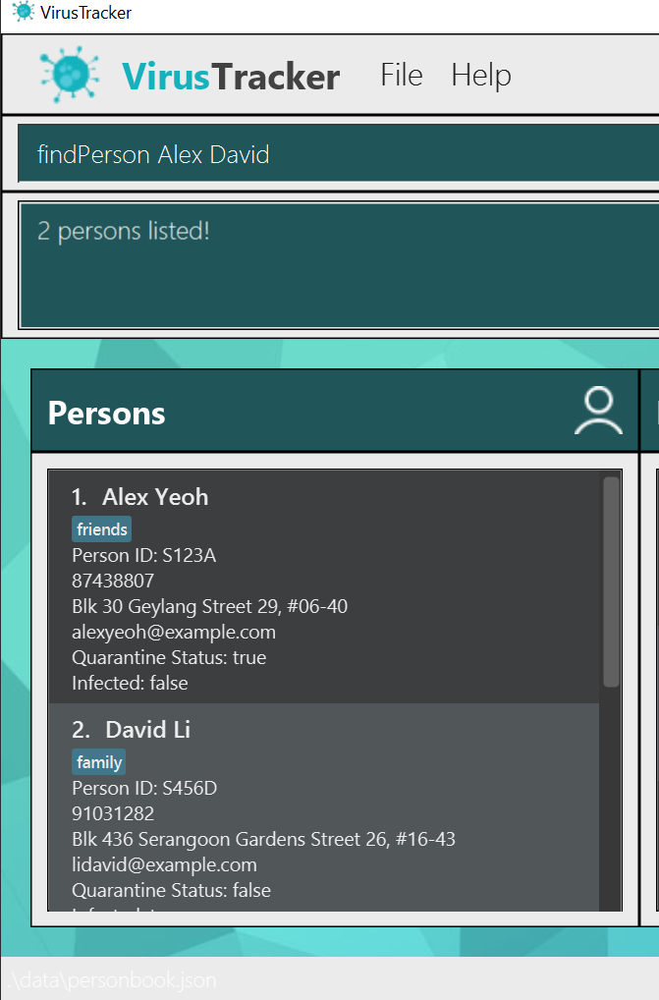

* Table of Contents
{:toc}
---

**VirusTracker** is a **desktop app for generating statistics for Covid-19, optimized for use via a Command Line Interface** (CLI) while still having the benefits of a Graphical User Interface (GUI).
It is mainly targeted towards healthcare officials who are handling large amounts of data due to the pandemic.
VirusTracker aims to provide a faster and quicker alternative to common data entry programs.

--------------------------------------------------------------------------------------------------------------------
## Preface

Welcome to the user guide on VirusTracker.

This guide will guide you through the different features that VirusTracker has to offer.
VirusTracker works with three main entities:
* People
* Locations
* Visits

The recommended way for you to use VirusTracker is to first store the information of all the people and locations you wish to track.
Then, whenever a person visits a location, the corresponding `visit` is added.

VirusTracker would be able to generate useful information based off the data that is input into the system.

## Quick start

1. Ensure you have Java `11` or above installed in your Computer.

2. Download the latest `virustracker.jar` from [here](https://github.com/AY2021S1-CS2103T-T13-4/tp/releases).  
   _Note: VirusTracker is still a work-in-progress and official releases are not available yet._
   
3. Copy the file to the folder you want to use as the _home folder_ for your AddressBook.

4. Double-click the file to start the app. The GUI similar to the below should appear in a few seconds. Note how the app contains some sample data. 
   

5. Type the command in the command box and press Enter to execute it. e.g. typing **`help`** and pressing Enter will open the help window. 
   Some example commands you can try:

   * **`list l/people`** : Lists all people.

   * **`addPerson`**`idp/1 n/John Doe p/98765432 e/johnd@example.com a/John street, block 123, #01-01 q/false i/false` : Adds a person named `John Doe` to the VirusTracker.

   * **`deletePerson`**`3` : Deletes the 3rd person shown in the current list.

   * **`clear`** : Deletes all entries from VirusTracker.

   * **`exit`** : Exits the app.

6. Refer to the [Features](#features) below for details of each command.

--------------------------------------------------------------------------------------------------------------------

## Features

**:information_source: Notes about the command format:** 

* Words in `UPPER_CASE` are the parameters to be supplied by the user. 
  e.g. in `add n/NAME`, `NAME` is a parameter which can be used as `add n/John Doe`.

* Items in square brackets are optional. 
  e.g `n/NAME [t/TAG]` can be used as `n/John Doe t/friend` or as `n/John Doe`.

* Items with `…`​ after them can be used multiple times including zero times. 
  e.g. `[t/TAG]…​` can be used as ` ` (i.e. 0 times), `t/friend`, `t/friend t/family` etc.

* Parameters can be in any order. 
  e.g. if the command specifies `n/NAME p/PHONE_NUMBER`, `p/PHONE_NUMBER n/NAME` is also acceptable.

* In the case of repeating parameters, the last parameter is taken. 
  e.g. if the command specifies `n/NAME p/PHONE_NUMBER_1 p/PHONE_NUMBER_2`, `p/PHONE_NUMBER_2` is taken and `PHONE_NUMBER_1` is ignored.

* In commands where the user would like to refer to a person or a location, the user has two options.  
  The user may either refer using the index of the person/location in the list or use the Id of the person/location. 
  e.g. `deleteLocation 3` deletes the 3rd location shown in the location list while `deleteLocation idl/L123` deletes the location with Id `L123`.

* **Data** refers collectively to people, locations and visits unless stated otherwise.

### Adding data

To add data to VirusTracker, there are `add` commands for each entity.

#### Adding a person

Adds a person to VirusTracker.

Format: `addPerson idp/ID n/NAME p/PHONE_NUMBER e/EMAIL a/ADDRESS q/QUARANTINE_STATUS i/INFECTED_STATUS [t/TAG]…​` 

:bulb: **Tip:**
A person can have any number of tags (including 0)

* `ID` of person must be unique. No other person in the VirusTracker may have the same ID.
* `QUARANTINE_STATUS` and `INFECTED_STATUS` only accept true or false.

Examples:
* `addPerson idp/S123 n/John Doe p/98765432 e/johnd@example.com a/John street, block 123, #01-01 q/true i/false`
* `addPerson idp/S234 n/Betsy Crowe t/friend e/betsycrowe@example.com a/Newgate Prison p/1234567 q/false i/true t/criminal`

#### Adding a location

Adds a location to VirusTracker.

Format: `addLocation idl/ID n/NAME a/ADDRESS`

* `ID` of location must be unique. No other location in the VirusTracker may have the same ID.

Examples:
* `addLocation idl/L123 n/Vivocity a/John street, block 123, #01-01`
* `addLocation idl/L234 n/Betsy Crowe's House a/Newgate Prison`

#### Adding a visit

Adds a visit by the person, location of visit and date of visit

Format: `addVisit PERSON_INDEX LOCATION_INDEX d/DATE`  
Format: `addVisit idp/PERSON_ID idl/LOCATION_ID d/DATE`

* Visits are used to track close contacts and to detect if infected/quarantined people visit locations they should not.
* Visits may be added by either using indexes or IDs to refer to the location and person. A mix of both is not allowed and will trigger a warning. 
* `PERSON_INDEX` refers to the index of the person as viewed from the most recently displayed people list.
* `LOCATION_INDEX` refers to the index of the location as viewed from the most recently displayed location list.
* The indexes **must be positive integers**: 1, 2, 3, …​ and within the range of its shown list, otherwise warnings will be triggered.
* `PERSON_ID` must belong to a person within VirusTracker.
* `LOCATION_ID` must belong to a location within VirusTracker.
* `DATE` refers to the date when the person visited the location
* Date format should follow "yyyy-MM-dd", otherwise exceptions would be thrown.

Examples:
* `addVisit 1 1 d/2020-09-12`
* `addVisit idp/S123 idl/L123 d/2020-02-02`

#### Adding data from CSV files

As you may have pre-existing data stored in the Excel file format, VirusTracker provides a way to import data directly from
files in the CSV format. Excel provides an option to save existing _.xlsx_ extension files as _.csv_ files.

:bulb: **Note:**
If you are importing data from a pre-existing Excel file, you may have to first format it to a format that is readable by VirusTracker.

You may read more about it [here](#format-for-csv-files).

:bulb: **Note:**
As visits rely on people and locations, it is recommended that person and location data csv files be added before visits so
as to ensure that the referenced people and locations in the visits data csv file exist.

Format: `addFromCsv FILE_PATH l/LIST_TYPE`

* `FILE_PATH` refers to the absolute file path where the CSV file resides.
  * For example, if you wish to import data from `personList.csv` located in your desktop, the absolute file path could look
  something like this: `C:/Users/user/Desktop/personList.csv` _(for Windows)_, `/Users/admin/Documents/personList.csv` _(for MacOS)_,
  `/home/user/docs/personList.csv` _(for Linux)_
  * You may **find the absolute file path** as follows
    1. Right-click your file `E.g. personList.csv`
    2. Select 'Properties'
    3. Take note of the path specified in the 'Location' field. `E.g. C:/Users/user/Desktop`
    4. The absolute file path is the path found in Step 3 along with your file name. `C:/Users/user/Desktop/personList.csv`
* `LIST_TYPE` refers to 'people', 'locations' or 'visits'.
  * The prefix `l/` is also used for [listing data](#listing-data-list)
* The CSV file should have its data in [VirusTracker readable format](#format-for-csv-files).
  * For visits data, the format used references the id of the people and locations. The format using
  list indexing is not supported.
* If you do not specify an absolute path, VirusTracker **may not be able to find your file!**

Examples:
* `addFromCsv C:/Users/alice/Desktop/peopleToAdd.csv l/people`
* `addFromCsv D:/visits on Dec 20.csv l/visits`

#### Exporting data to CSV files

Often, you may not only work on a single device. 

VirusTracker enables you to export the current data stored into a CSV file 
which could then be read by the VirusTracker application on another device.

Format: `exportToCsv FILE_PATH l/LIST_TYPE`

* `FILE_PATH` refers to the absolute file path where the CSV file should reside.
  * Refer to the [Adding data from CSV files](#adding-data-from-csv-files) section to find out the absolute path of a file.
  * If the CSV file does not exist at the specified location, VirusTracker will create it for you.
* `LIST_TYPE` refers to 'people', 'locations' or 'visits'.
  * The prefix `l/` is also used for [listing data](#listing-data-list)
* The CSV file will have its data in [VirusTracker readable format](#format-for-csv-files).
* If you do not specify an absolute path, the file may be **created at an unexpected place!**

Examples:
* `exportToCsv C:/Users/alice/Desktop/peopleToAdd.csv l/people` creates a people data CSV file named `peopleToAdd.csv`
* `exportToCsv D:/visits on Dec 20.csv l/visits` creates a visit data CSV file named `visits on Dec 20.csv`

### Format for CSV files

As data can be formatting differently from file to file, VirusTracker specifies a certain format for CSV files to be imported.

* Depending on the entity, the format for each row will follow its relevant `add` command.
  * For example, for a CSV file adding locations, each row will correspond to an individual [addLocation](#adding-a-location) command format.
  
  * As you can see from the figure above, each row is a valid `addLocation` command, with the command word omitted. 
  * Each column corresponds to a field in `addLocation` format.
  * As with the commands themselves, the order of the arguments do not matter.
  * You **MAY NOT** have data of different formats in the same CSV file. (i.e. adding people from rows 1 to 4, then locations from 5 to 8, etc.)

The conversion of pre-existing data to the required CSV format may require a bit of effort. Below are some tips to guide you along.
* It is recommended to create a new CSV file for importing instead of using the pre-existing data file to prevent data loss.
* Copy the rows of relevant data (name, addresses, dates, etc) into the new file.
* Using Excel functions, you can prepend the required prefixes to each data field.
* CSV files exported by VirusTracker already have this format and do not need to be reformatted.

#### Using Excel to add prefixes

The data present may be in a different format than what VirusTracker requires. Hence, below is a step by step guide to convert the common 
types of data fields to their required format.

The diagram below shows possible data columns pre-formatting. Column A represents a `PERSON_ID` and Column B represents `DATE` in this case.

Find an empty column, and type the function in the diagram shown below.

Upon pressing enter, you should see that the prefix has been prepended to the first item in column A as shown below.

You may then click the bottom right corner of the formatted cell, C1 in this case, and drag downwards to fill the remaining cells.
Alternatively, you could also choose `Fill` -> `Down` from the menu bar.
 
 You should see a result similar to below.

For date fields, the format of the function is slightly different. The date has to be formatted to the correct date format in addition
to being prepended with the date prefix.

The below function in the diagram **only works if the field is a date.**

You may then similarly fill the cells as shown in the two diagrams below.

#### Replacing the data

After creating the formatted data, you may be tempted to directly copy the new data into the column containing the preformatted data.

However, this would result in an error as the formatted data is currently referencing the old data. To fix this, we should paste the values using
`Paste Special`.

For example, if you wished to copy formatted data from column C to column A, right click on A as shown below.

Select `Paste Special` -> `Values` as shown below.

Column A now has the formatted data and column C can be deleted.

### Deleting data: 
To delete data from VirusTracker, there are various `delete` commands that could be used.

#### Deleting a person

Deletes the specified person from the people list.

Format: `delete PERSON_INDEX`  
Format: `delete idp/PERSON_ID` 

* Deletes the person at the specified `PERSONS_INDEX` or deletes the person with the specified `PERSON_ID`.
* `PERSON_INDEX` refers to the index of the person as viewed from the most recently displayed people list.
* The index **must be a positive integer** 1, 2, 3, …​
* `PERSON_ID` must belong to a person within VirusTracker.
* All visits made by the specified person would also be deleted.

Examples:
* `list l/infected` followed by `delete 2` deletes the 2nd infected person in the displayed people list.
* `find Betsy` followed by `delete 1` deletes the 1st person in the results of the `find` command.
* `delete idp/S123` deletes the person with the ID S123.

#### Deleting a location

Deletes the specified location from the location list.

Format: `deleteLocation LOCATION_INDEX`  
Format: `deleteLocation idl/LOCATION_ID` 

* Deletes the location at the specified `LOCATION_INDEX` or deletes the location with the specified `LOCATION_ID`.
* `LOCATION_INDEX` refers to the index of the location as viewed from the most recently displayed location list.
* The index **must be a positive integer** 1, 2, 3, …​
* `LOCATION_ID` must belong to a location within VirusTracker.
* All visits that contains the specified locations would also be deleted.

Examples:
* `list l/locations` followed by `deleteLocation 2` deletes the 2nd location in the displayed location list.
* `delete idl/L123` deletes the location with the ID L123.

#### Deleting visits using date

Deletes all visits before and including the date.

Format: `deleteVisits d/DATE`

* `DATE` refers to a valid date within the visits list.
* A `DATE` is valid if **at least one** visit contains the specified date.
* All the visits before and including the date will be removed from the visits list.
* Date format should follow "yyyy-MM-dd", otherwise exceptions would be thrown.

Examples:
* `deleteVisits d/2020-09-12`

### Editing data: 
To edit data in VirusTracker, there are various `edit` commands that could be used.

#### Editing a person

Edits an existing person in VirusTracker.

Format: `edit PERSON_INDEX [n/NAME] [p/PHONE] [e/EMAIL] [a/ADDRESS] [q/QUARANTINE_STATUS] [t/TAG]…​`  
Format: `edit idp/PERSON_ID [n/NAME] [p/PHONE] [e/EMAIL] [a/ADDRESS] [q/QUARANTINE_STATUS] [t/TAG]…​` 

* A person's ID cannot be edited.
* Edits the person at the specified `PERSON_INDEX` or the person with the specified `PERSON_ID`.
* `PERSON_INDEX` refers to the index of the person as viewed from the most recently displayed person list.
* The index **must be a positive integer** 1, 2, 3, …​
* `PERSON_ID` must belong to a person within VirusTracker.
* At least one of the optional fields must be provided.
* Existing values will be updated to the input values.
* When editing tags, the existing tags of the person will be removed i.e adding of tags is not cumulative.
* You can remove all the person’s tags by typing `t/` without
    specifying any tags after it.

Examples:
*  `editPerson 1 p/91234567 e/johndoe@example.com` Edits the phone number and email address of the 1st person to be `91234567` and `johndoe@example.com` respectively.
*  `editPerson idp/S123A n/Betsy Crower t/` Edits the name of the person with ID S123 to be `Betsy Crower` and clears all existing tags.

#### Editing a location

Edits an existing location in VirusTracker.

Format: `editLocation LOCATION_INDEX [n/NAME] [a/ADDRESS]`  
Format: `editLocation idl/LOCATION_ID [n/NAME] [a/ADDRESS]`

* A location's ID cannot be edited.
* Edits the location at the specified `LOCATION_INDEX` or the location with the specified `LOCATION_ID`.
* `LOCATION_INDEX` refers to the index of the location as viewed from the most recently displayed location list.
* The index **must be a positive integer** 1, 2, 3, …​
* `LOCATION_ID` must belong to a location within VirusTracker.
* At least one of the optional fields must be provided.
* Existing values will be updated to the input values.

Examples:
*  `editLocation 1 n/NTU a/Bugis street` Edits the name and address of the 1st location to be `NTU` and `Bugis Street` respectively.
*  `editLocation idl/L123A n/NUS` Edits the name of the location with ID L123A to be `NUS`.

### Finding persons by name:

Finds persons whose names contain any of the given keywords.

Format: `findPerson KEYWORD [MORE_KEYWORDS]`

* The search is case-insensitive. e.g `hans` will match `Hans`
* The order of the keywords does not matter. e.g. `Hans Bo` will match `Bo Hans`
* Only the name is searched.
* Only full words will be matched e.g. `Han` will not match `Hans`
* Persons matching at least one keyword will be returned (i.e. `OR` search).
  e.g. `Hans Bo` will return `Hans Gruber`, `Bo Yang`

Examples:
* `find John` returns `john` and `John Doe`
* `find alex david` returns `Alex Yeoh`, `David Li` 
  

### Listing data:

There are a variety of `list` commands that list different types of data.

#### Listing all people 
Format: `list l/people`

* Displays the list of all people currently stored in VirusTracker.

#### Listing all infected people 
Format: `list l/infected`

* Displays the list of all people that are currently infected.

#### Listing all quarantined people 
Format: `list l/quarantined`

* Displays the list of all people currently in quarantine.

#### Listing all locations
Format: `list l/locations`

* Displays the list of all locations currently stored in VirusTracker.

#### Listing all visits
Format: `list l/visits`

* Displays the list of all visits currently stored in VirusTracker.

#### Listing high risk locations

Lists the locations with high risk of Covid infection.

Format: `list l/high-risk-locations`

* A location is considered as infected if an infected person visited that location.
* If number of infected locations are more than 60% of number of total locations, number of high risk locations equals 
to 40% of number of total locations. Else, number of high risk locations equals to number of infected locations.
* Let number of high risk locations be `n`. The first `n` number of most infected locations are shown.
* For example, number of total locations is `10`, number of infected locations is `7`, so the number of high risk 
locations is `40% * 10 = 4`. The first `4` infected locations from the list of infected locations sorted from highest to 
lowest risk are displayed.
* If there are less than ten locations that are infected, all locations will
  be shown.
  
#### Listing summary of data

Shows the general summary of the data in the form of statistics.

Format: `list l/stats`

* Data used to generate statistics are the people, locations and visits added into VirusTracker.
* Currently, the statistics generated include:
    1. Total number of people, locations and visits
    2. Total number of people infected/quarantined
    3. Percentage of people infected/quarantined
* The above provides a brief summary of the pandemic and is subject to extension.

### Generating all locations visited by a person: `generateLocations`

Shows a list of locations visited by an infected person in the past 2 weeks. 

Format: `listAllLocationsVisited LOCATION_INDEX`

* Locations listed were visited by the infected person of the index given.
* The result given is a filtered list of locations that the person visited in the past 2 weeks.
* This function can be used to identify locations needing to be disinfected after being visited by an infected person.

### Generating all people in contact with an infected person: `generatePeople`

Shows a list of people who were in contact with an infected person in the past 2 weeks. 

Format `listAllPersonsInContact PERSON_INDEX`

* People listed were in contact with the infected person of the index given.
* The result given is a filtered list of people who visited the same locations as that the infected person in the past 2 weeks.
* This function can be used to identify people who need to be quarantined or issued Stay Home Notices.

### Clearing all entries : `clear`

Clears all entries from VirusTracker.

Format: `clear`

### Viewing help : `help`

Shows a message explaning how to access the help page.

Format: `help`

### Exiting the program : `exit`

Exits the program.

Format: `exit`

### Saving the data

VirusTracker data saves in the hard disk automatically after any command that changes the data. There is no need to save manually.

### Archiving data files `[coming in v2.0]`

_{explain the feature here}_

--------------------------------------------------------------------------------------------------------------------

## FAQ

**Q**: How do I transfer my data to another Computer? 
**A**: Install the app in the other computer and overwrite the empty data file it creates with the file that contains the data of your previous AddressBook home folder.

--------------------------------------------------------------------------------------------------------------------
## Glossary
Term | Meaning
--------|------------------
Entity | Refers to people, locations or visits

--------------------------------------------------------------------------------------------------------------------

## Command summary

Action | Format, Examples
--------|------------------
**Add** | `add n/NAME p/PHONE_NUMBER e/EMAIL a/ADDRESS q/QUARANTINE_STATUS [t/TAG]…​`   e.g., `add n/James Ho p/22224444 e/jamesho@example.com a/123, Clementi Rd, 1234665 t/friend t/colleague`
**Clear** | `clear`
**Delete** | `delete PERSON_INDEX`  e.g., `delete 3`
**Edit** | `edit PERSON_INDEX [n/NAME] [p/PHONE_NUMBER] [e/EMAIL] [a/ADDRESS] [q/QUARANTINE_STATUS] [t/TAG]…​`  e.g.,`edit 2 n/James Lee e/jameslee@example.com`
**Find** | `find KEYWORD [MORE_KEYWORDS]`  e.g., `find James Jake`
**List** | `list l/KEYWORD`   e.g., `list l/people`, `list l/stats`
**Help** | `help`
